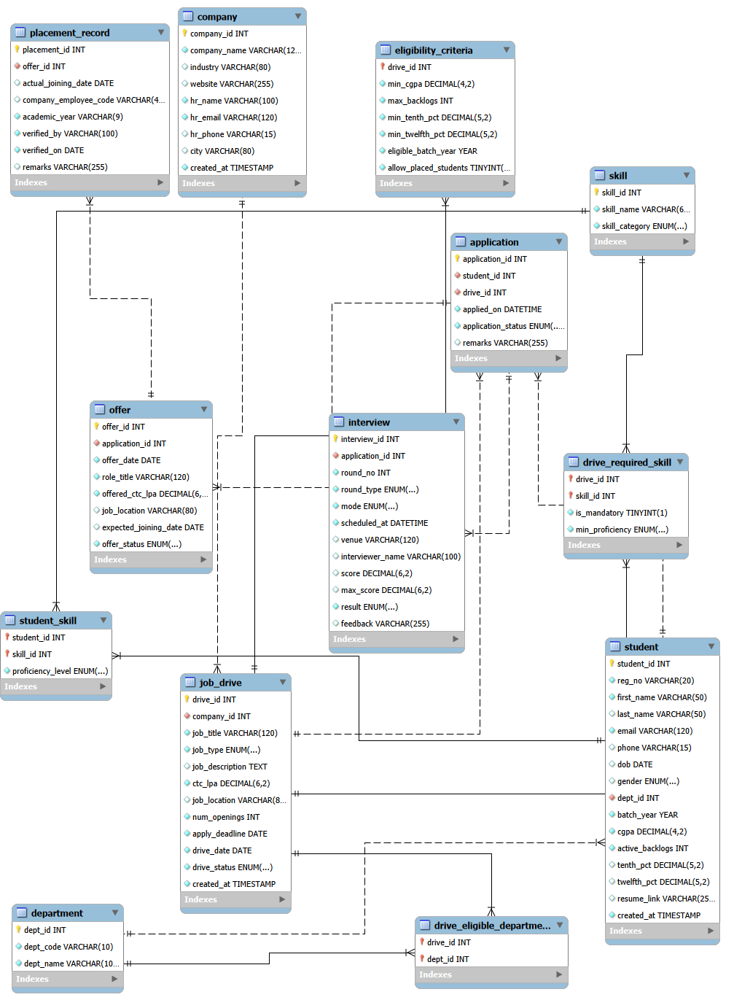

# Smart Campus Placement Management System

**Phase 1 — Database Design and Implementation**

A normalised relational database for a college placement cell, built on MySQL 8.0.
It models students, recruiting companies, job drives and their eligibility criteria,
skills, applications, interview rounds, offers and verified placement records.

This repository contains the complete Phase 1 deliverable: the ER/EER model, the
relational schema, the normalisation analysis, the executable DDL scripts and the
evidence captured from the running database.

---

## Problem

Most college placement cells run on spreadsheets, shared folders and email. Student
profiles, company requirements, eligibility rules, interview schedules and the final
placement figures live in separate files maintained by different people. That produces
a recurring set of failures:

- A CGPA corrected in one sheet stays stale in another.
- Eligibility has to be re-checked by hand for every drive, against cut-offs that are
  written in a notice rather than stored anywhere.
- Nothing prevents the same student being recorded twice against the same drive, or a
  student being scheduled for a company they never applied to.
- Skills are kept as free text, so "which candidates know SQL" cannot be answered by a query.
- An offer a student *accepted* and a placement the student *actually joined* are stored
  as the same fact, so the end-of-year placement percentage must be reconciled manually.

The database moves these records into one place and turns conventions that a person used
to enforce into constraints that the DBMS enforces.

## Objectives

1. Model the placement process in Third Normal Form so that no fact is stored twice.
2. Resolve every many-to-many relationship through an explicit bridge or associative relation.
3. Separate an accepted offer from a verified placement, so statistics come from confirmed joinings.
4. Enforce business rules in the schema itself using keys, `UNIQUE`, `NOT NULL`, `DEFAULT`,
   `ENUM` domains and `CHECK` constraints.
5. Store no derived value that can be computed from existing data.
6. Guarantee referential integrity with InnoDB foreign keys and per-relationship delete rules.
7. Produce a schema that supports Phase 2 and Phase 3 without structural change.

---

## Database architecture

Database `smart_campus_placement` — **13 tables**, all InnoDB, all `utf8mb4` / `utf8mb4_0900_ai_ci`.

| # | Table | Type | Purpose |
|---|---|---|---|
| 1 | `department` | strong entity | Branch master. Drives are opened to selected branches. |
| 2 | `skill` | strong entity | Skill master, shared by students and drives. |
| 3 | `company` | strong entity | Recruiting organisation and its HR contact. |
| 4 | `student` | strong entity | The candidate, with academic and contact details. |
| 5 | `job_drive` | strong entity | One job opening conducted by one company. |
| 6 | `eligibility_criteria` | optional 1:1 dependent | Cut-offs for one drive. PK is also the FK. |
| 7 | `drive_eligible_department` | bridge | Resolves `job_drive` ↔ `department` (M:N). |
| 8 | `student_skill` | associative bridge | Resolves `student` ↔ `skill` (M:N), carries proficiency. |
| 9 | `drive_required_skill` | associative bridge | Resolves `job_drive` ↔ `skill` (M:N). |
| 10 | `application` | associative entity | Resolves `student` ↔ `job_drive` (M:N). Has its own children. |
| 11 | `interview` | dependent entity | One round of one application. |
| 12 | `offer` | 1:1 dependent | At most one offer per application. |
| 13 | `placement_record` | 1:1 dependent | A verified joining against an accepted offer. |

### Constraint summary

| Constraint type | Count |
|---|---|
| Primary keys | 13 (3 composite) |
| Foreign keys | 14 (all explicitly named) |
| `UNIQUE` constraints | 13 (3 composite) |
| `CHECK` constraints | 21 (all explicitly named) |
| `ENUM` domains | 11 columns |

### Relationships

| Entity A | Relationship | Entity B | Cardinality | Resolved by |
|---|---|---|---|---|
| `department` | has | `student` | 1:N | FK in `student` |
| `company` | conducts | `job_drive` | 1:N | FK in `job_drive` |
| `job_drive` | governed by | `eligibility_criteria` | 1:1 optional | PK = FK |
| `job_drive` | open to | `department` | M:N | `drive_eligible_department` |
| `student` | possesses | `skill` | M:N | `student_skill` |
| `job_drive` | requires | `skill` | M:N | `drive_required_skill` |
| `student` | applies to | `job_drive` | M:N | `application` |
| `application` | has | `interview` | 1:N | FK in `interview` |
| `application` | results in | `offer` | 1:1 | `UNIQUE` FK |
| `offer` | confirmed as | `placement_record` | 1:1 | `UNIQUE` FK |

---

## Key design decisions

- **All 13 relations are in 3NF, and also in BCNF.** In every relation each determinant is a
  candidate key. The normalisation analysis in the Phase 1 report verifies this relation by
  relation using the actual keys and functional dependencies.
- **Four M:N relationships, four bridge relations.** Eligible departments and required skills
  are deliberately kept in two separate relations; combining them would create a multivalued
  dependency and violate 4NF.
- **`eligibility_criteria` is a 1:1 dependent whose primary key is also its foreign key.**
  That is what enforces the 1:1 in the schema instead of in application code. Participation
  is optional, so a drive with no cut-offs carries no NULL columns.
- **`offer` and `placement_record` are separate entities.** An accepted offer is the student's
  intention; a placement record is the placement cell's verified outcome. `placement_record`
  stores no column that already exists in `offer`.
- **`hr_email` is `NOT NULL UNIQUE` on purpose.** That makes it a candidate key of `company`,
  which is why `hr_email → hr_name` is a key dependency rather than a 3NF violation.
- **No derived attributes are stored.** Placement status, age, applicant counts and the current
  interview round are all computable, and will be exposed as views in Phase 2.
- **Delete rules are chosen per relationship**, not applied uniformly: `CASCADE` where a child
  has no meaning without its parent, `RESTRICT` where the row is placement history.
- **Foreign keys live in their own script** so table creation order never blocks a rerun and
  every referential constraint carries an explicit, greppable name.
- **Cross-table rules are documented, not faked.** A MySQL `CHECK` may only read columns of
  the row being written, so rules such as "a placement record requires an accepted offer" are
  recorded in `database/README.md` as Phase 2 trigger or application work.

---

## Technology stack

| Layer | Choice |
|---|---|
| DBMS | MySQL 8.0.46 Community Edition |
| Storage engine | InnoDB (required — MyISAM ignores foreign keys) |
| Character set | `utf8mb4`, collation `utf8mb4_0900_ai_ci` |
| Tooling | MySQL Workbench (EER diagram and evidence capture) |
| Scripts | Plain MySQL DDL, run locally, no external services |

> `CHECK` constraints are only **enforced** from MySQL **8.0.16**. Earlier versions parse
> them and ignore them silently.

---

## Project status

| Phase | Scope | Status |
|---|---|---|
| **Phase 1** | Requirement analysis, ER/EER diagram, relational model, normalisation, DDL | **Complete** — this repository |
| Phase 2 | DML and data population, business logic, front end, database connectivity | Planned |
| Phase 3 | Testing, validation, demonstration, final documentation | Planned |

Phase 1 contains **no triggers, no views, no sample data and no application code**. Those are
Phase 2 work and are listed here as planned, not as delivered.

---

## Repository structure

```
.
├── README.md
├── .gitignore
├── database/
│   ├── 01_create_database.sql   schema, character set and collation
│   ├── 02_create_tables.sql     13 tables: PK, UNIQUE, NOT NULL, DEFAULT, ENUM, CHECK
│   ├── 03_constraints.sql       14 named FOREIGN KEY constraints
│   ├── 04_verify.sql            verification queries against INFORMATION_SCHEMA
│   └── README.md                run order and constraint enforcement strategy
└── docs/
    ├── final/
    │   ├── Smart_Campus_Placement_Phase_1_Report.pdf
    │   └── Smart_Campus_Placement_Phase_1_Report.docx
    └── evidence/
        ├── S1_workbench_tables.png
        ├── S2_show_tables.png
        ├── S3_describe_student.png
        ├── S4_describe_student_skill.png
        ├── S5_foreign_keys.png
        └── S6_eer_diagram.png
```

---

## Creating the database

Requires MySQL Server 8.0.16 or later.

```bash
cd database

mysql -u <your_user> -p < 01_create_database.sql
mysql -u <your_user> -p < 02_create_tables.sql
mysql -u <your_user> -p < 03_constraints.sql
mysql -u <your_user> -p < 04_verify.sql
```

Or open each file in MySQL Workbench and run it in order.

Scripts `02` and `03` are re-runnable: `02` drops the 13 tables in reverse dependency order
before creating them. Script `04` prints the verification output used as evidence in the
Phase 1 report.

Table creation order follows the foreign key graph, which is acyclic:

```
level 0 : department, skill, company
level 1 : student, job_drive
level 2 : eligibility_criteria, drive_eligible_department,
          student_skill, drive_required_skill, application
level 3 : interview, offer
level 4 : placement_record
```

See [`database/README.md`](database/README.md) for the full run order and the three-tier
constraint enforcement strategy.

---

## EER diagram

Reverse-engineered in MySQL Workbench from the live `smart_campus_placement` schema, so it
reflects the database as actually created.



Full-resolution file: [`docs/evidence/S6_eer_diagram.png`](docs/evidence/S6_eer_diagram.png)

---

## Phase 1 report

📄 **[Smart_Campus_Placement_Phase_1_Report.pdf](docs/final/Smart_Campus_Placement_Phase_1_Report.pdf)**

The report covers the problem statement and objectives, functional and non-functional
requirements, entity and attribute identification for all 13 tables, the EER diagram, the
relational model, a 1NF / 2NF / 3NF analysis carried out against the actual keys, the
database design and constraint strategy, implementation evidence captured from the running
database, and the complete DDL in an appendix.

An editable `.docx` source is in the same folder.

### Implementation evidence

| Figure | File |
|---|---|
| Workbench schema showing the project tables | [`S1_workbench_tables.png`](docs/evidence/S1_workbench_tables.png) |
| `SHOW TABLES` output | [`S2_show_tables.png`](docs/evidence/S2_show_tables.png) |
| `student` table structure | [`S3_describe_student.png`](docs/evidence/S3_describe_student.png) |
| `student_skill` composite primary key | [`S4_describe_student_skill.png`](docs/evidence/S4_describe_student_skill.png) |
| Foreign-key metadata from `INFORMATION_SCHEMA` | [`S5_foreign_keys.png`](docs/evidence/S5_foreign_keys.png) |
| Generated EER diagram | [`S6_eer_diagram.png`](docs/evidence/S6_eer_diagram.png) |

---

## Academic context

Database Systems (BACSE202) · Fall Semester 2026–27 · Assessment 8, Project Phase 1
Author: Prayag Krishna
